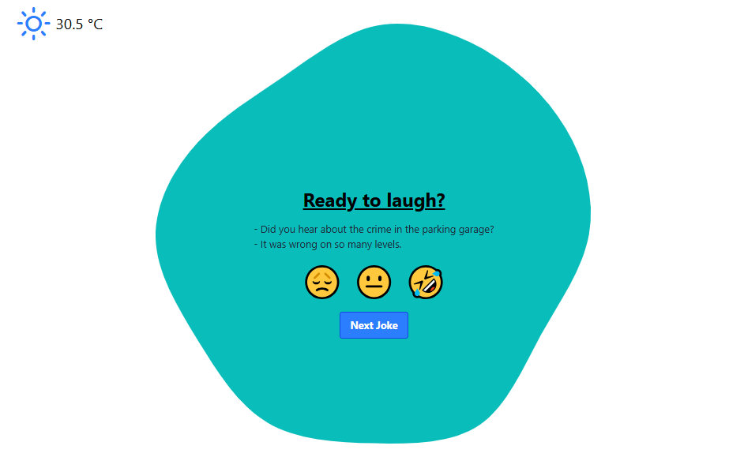

# Chistes y el tiempo (Consumo de API) 

## 📄 Descripción

Esta aplicación web muestra un chiste aleatorio y el clima actual en Barcelona. Puedes calificar los chistes y se guarda un historial local de puntuaciones.  
Aplicación desarrollada con Vite, TypeScript y TailwindCSS, que consume dos APIs públicas de chistes y datos meteorológicos en tiempo real.

## 🚀 App 


## 💻 Tecnologías Utilizadas

* Vite
* TypeScript
* Tailwind CSS (CDN)
* APIs públicas de chistes  
  * [icanhazdadjoke](https://icanhazdadjoke.com/)
  * [Official Joke API](https://official-joke-api.appspot.com/)
* Open-Meteo API
  * [Open-Meteo](https://open-meteo.com/)
* Weather Icons
  * [Weather Icons](https://cdnjs.cloudflare.com/ajax/libs/weather-icons/2.0.10/css/weather-icons.min.css)

## 📦 Instalación y ejecución local

Asegúrate de tener [Node.js](https://nodejs.org/) versión 18 o superior instalada.  

### 💻 Pasos en Visual Studio Code

1. Abre **Visual Studio Code**.
2. Abre la carpeta del proyecto (`File > Open Folder...`).
3. Abre una terminal (`Terminal > New Terminal`).
4. Ejecuta los siguientes comandos:

```bash
# Clona el repositorio si aún no lo has hecho
git clone https://github.com/mgonzalesdev/Sprint4-Typescript-API.git

# Instala las dependencias del proyecto
npm install

# Inicia el servidor de desarrollo
npm run dev
```

5. Abre el navegador y visita `http://localhost:5173` para ver la aplicación.
